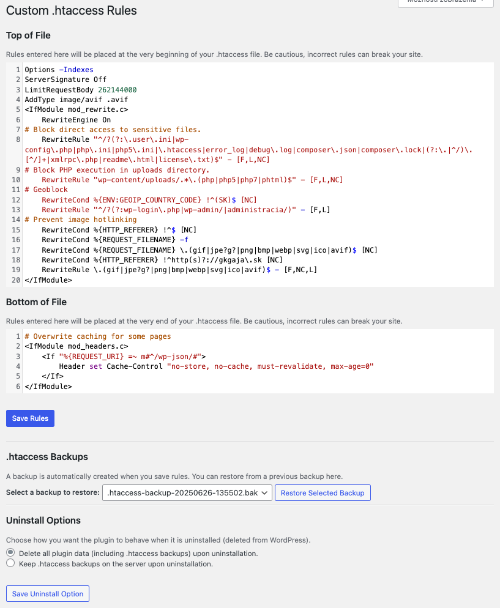

# Custom .htaccess Rules Manager

Manage custom `.htaccess` rules (top and bottom blocks) with shell-mode syntax highlighting and an auto-expanding editor.

## Description

The "Custom .htaccess rules manager" plugin provides a secure and intuitive interface within your WordPress admin dashboard to manage custom rules for your `.htaccess` file. This powerful tool allows you to insert specific rules at both the very beginning and very end of your `.htaccess` file, ensuring they are applied correctly without interfering with WordPress's own core rules.

### Key Features:

* **Top and Bottom Blocks:** Dedicated sections to add rules that appear before and after WordPress's standard `.htaccess` content.

* **Shell-Mode Syntax Highlighting:** Makes writing and reviewing `.htaccess` rules easier with clear visual cues.

* **Auto-Expanding Editor:** The editor automatically adjusts its height to fit your content, providing a comfortable editing experience.

* **Automatic Backups:** Every time you save new rules, a backup of your existing `.htaccess` file is automatically created, providing a safety net.

* **Backup Restoration:** Easily restore your `.htaccess` file from a list of the last 10 backups directly from the plugin settings page.

* **Uninstall Options:** Choose whether to delete `.htaccess` backups or keep them on your server when uninstalling the plugin.

* **WordPress Filesystem API Integration:** All file operations are performed using WordPress's robust WP_Filesystem API, ensuring compatibility and security across various hosting environments.

**Important Note:** Modifying the `.htaccess` file incorrectly can lead to your website becoming inaccessible. Always exercise caution and ensure you understand the rules you are adding. The backup feature is designed to help, but careful testing is always recommended.

## Installation

1.  **Upload:**
    * Download the plugin ZIP file from the [WordPress.org plugin directory](https://wordpress.org/plugins/custom-htaccess-rules/).
    * Go to your WordPress admin dashboard, navigate to `Plugins > Add New`.
    * Click on the "Upload Plugin" button at the top.
    * Choose the downloaded ZIP file and click "Install Now".

2.  **Activate:**
    * Once installed, click "Activate Plugin".

3.  **Configure:**
    * Go to `Settings > Custom .htaccess` in your WordPress admin menu.
    * Add your desired rules in the "Top of File" and "Bottom of File" text areas.
    * Click "Save Rules".
    * You can also manage backups and uninstall options from this page.

## Frequently Asked Questions

### What is the .htaccess file?

The `.htaccess` file is a powerful configuration file used by Apache web servers. It allows for decentralized management of web server configuration on a per-directory basis, enabling features like URL rewriting, access control, password protection, and more, without needing to modify the main server configuration.

### Why are there "Top of File" and "Bottom of File" sections?

WordPress automatically manages certain parts of your `.htaccess` file. Placing custom rules at the very top or very bottom ensures they are processed either before WordPress's default rules (top) or after them (bottom), preventing conflicts and ensuring your rules are applied as intended.

### What kind of rules can I add?

You can add various Apache directives, such as:

* Redirections (`Redirect`, `RewriteRule`)
* Blocking IP addresses or user agents
* Setting custom error pages
* Modifying caching headers
* Disabling directory browsing
* Enforcing HTTPS
* And many more!

**Always ensure the rules you add are valid Apache directives.**

### What if I break my site?

The plugin creates a backup of your `.htaccess` file every time you save changes. If your site becomes inaccessible after saving rules, you can:

1.  Access your site via FTP or your hosting's file manager.
2.  Navigate to your WordPress root directory and find the `.htaccess` file.
3.  Go to `wp-content/uploads/htaccess-backups/`.
4.  Download the most recent backup file (e.g., `.htaccess-backup-YYYYMMDD-HHMMSS.bak`).
5.  Rename your current, problematic `.htaccess` file (e.g., to `.htaccess_old`).
6.  Upload the backup file and rename it to `.htaccess`.
7.  Alternatively, if you can still access your WordPress admin, go to `Settings > Custom .htaccess` and use the "Restore Selected Backup" option.

### How many backups are kept?

The plugin keeps the last 10 backups of your `.htaccess` file. Older backups are automatically discarded to save space.

### What happens to my backups when I uninstall the plugin?

On the `Settings > Custom .htaccess` page, there's an "Uninstall Options" section where you can choose whether to "Delete all plugin data (including .htaccess backups) upon uninstallation" or "Keep .htaccess backups on the server upon uninstallation." This gives you control over your data.

## Screenshots

## Changelog

### 1.0.0

* Initial release of the Custom .htaccess rules manager plugin.

* Features include: Top and Bottom rule blocks, shell-mode syntax highlighting, auto-expanding editor, automatic .htaccess backups, backup restoration, and uninstall options.

* Full integration with WordPress Filesystem API for secure file operations.